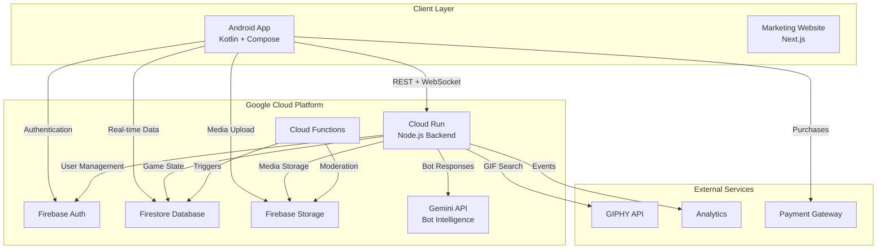
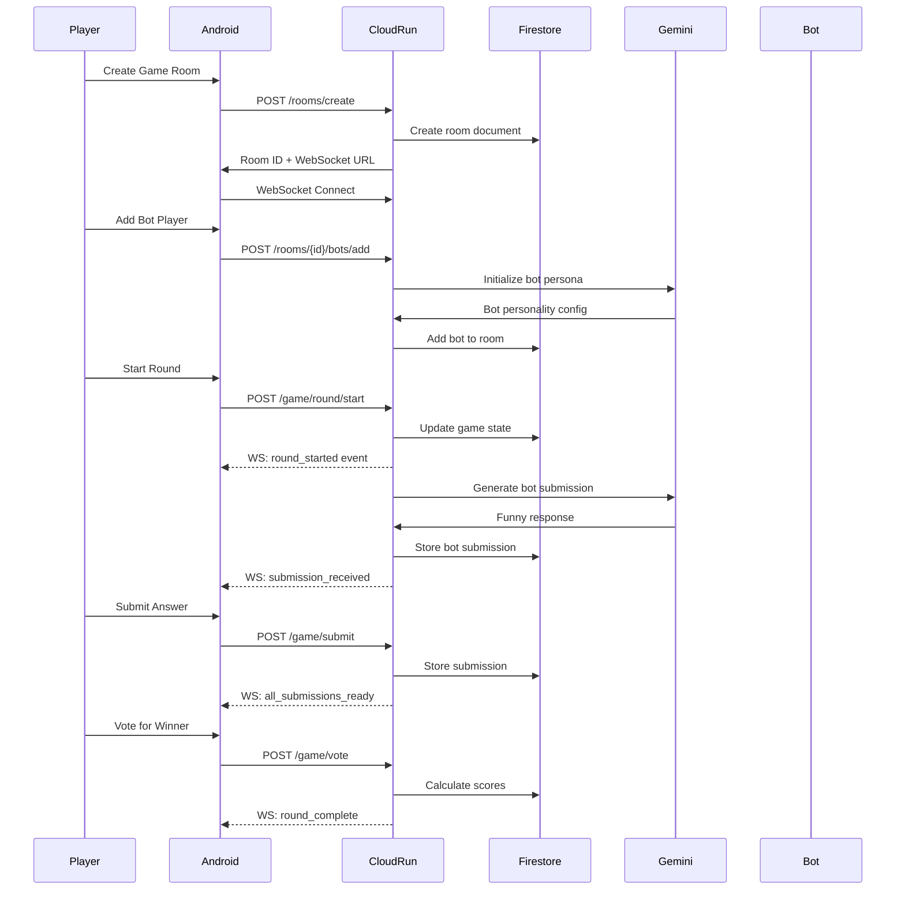
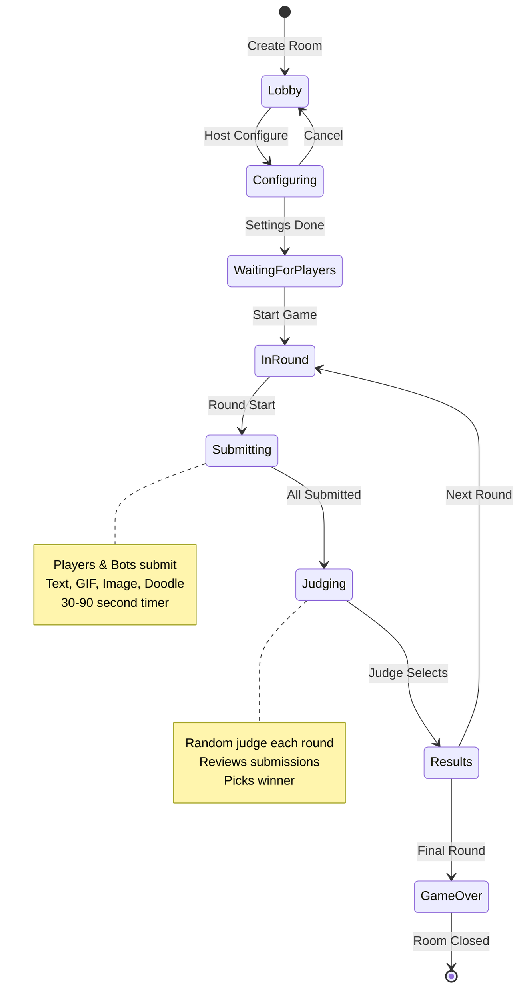
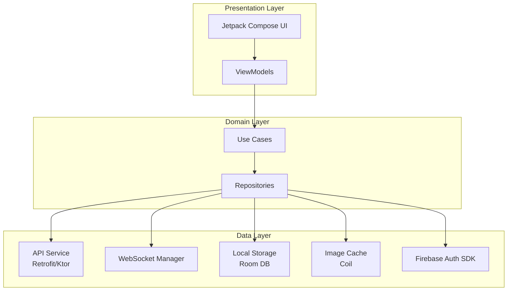
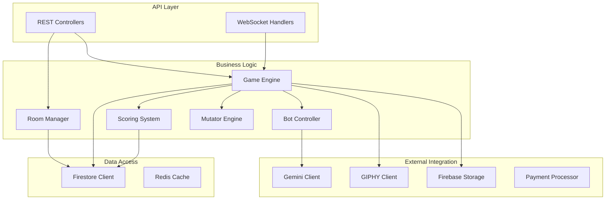
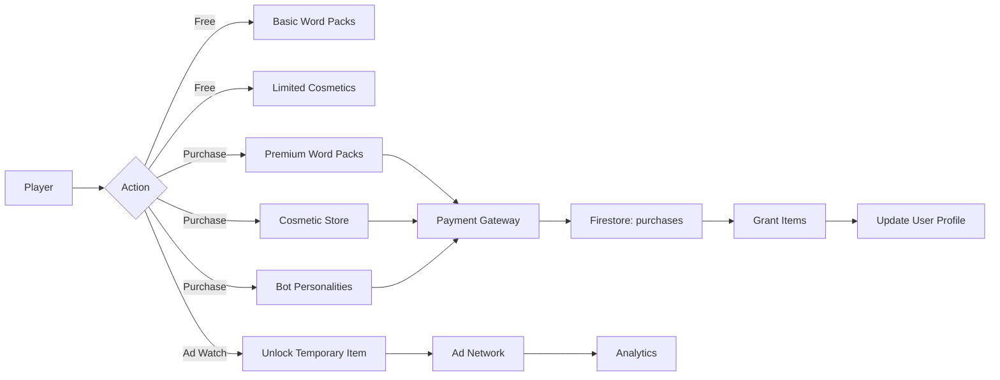
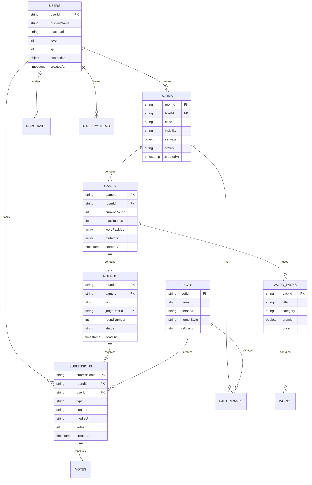
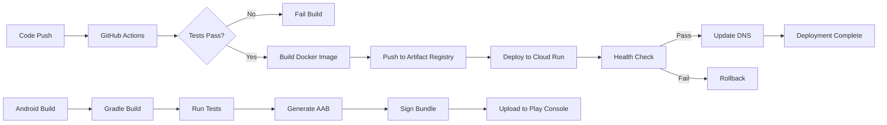

# Hornswoggled - Complete System Architecture

## 🎯 System Overview

Hornswoggled is a real-time multiplayer party game platform where players compete to create the funniest definitions, memes, and responses to prompts. AI-powered bots join games to enhance gameplay and provide hilarious competition.

## 📊 Architecture Diagrams

### 1. High-Level System Architecture



### 2. Data Flow Architecture



### 3. Real-time Game Room System



### 4. Android Application Architecture



### 5. Backend Service Architecture



### 6. Monetization Flow



### 7. Database Schema Overview



### 8. Deployment Pipeline



## 🔧 Technology Stack Details

### Android Client
- **Language**: Kotlin 1.9+
- **UI Framework**: Jetpack Compose
- **Architecture**: MVVM + Clean Architecture
- **DI**: Hilt
- **Networking**: Ktor Client
- **WebSocket**: OkHttp WebSocket
- **Image Loading**: Coil
- **Local Storage**: Room Database
- **Auth**: Firebase Auth SDK
- **Analytics**: Firebase Analytics

### Backend Service
- **Runtime**: Node.js 20 LTS
- **Framework**: Express.js
- **WebSocket**: ws library
- **Database**: Firestore
- **Storage**: Firebase Storage
- **AI**: Google Gemini API (free tier)
- **Container**: Docker
- **Hosting**: Cloud Run (free tier)

### Marketing Website
- **Framework**: Next.js 14
- **Styling**: Tailwind CSS
- **Animations**: Framer Motion
- **Deployment**: Vercel/Cloud Run
- **Analytics**: Google Analytics

### Infrastructure
- **Cloud Provider**: Google Cloud Platform
- **CDN**: Firebase Hosting
- **Functions**: Cloud Functions
- **Monitoring**: Cloud Logging
- **CI/CD**: GitHub Actions

## 🎮 Core Game Mechanics

### Submission Types
1. **Text**: Classic text-based answers
2. **GIF**: GIPHY integration for animated responses
3. **Image**: Photo uploads from device or camera
4. **Doodle**: Canvas drawing tool
5. **Emoji Mashup**: Combine emojis to create meaning

### Mutators (Game Modifiers)
- **Chaos Mode**: Random constraints each round
- **Speed Round**: 15-second submission timer
- **Bot Invasion**: Extra bots join mid-game
- **Reverse**: Worst answer wins
- **Combo**: Require multiple submission types

### Powerups
- **Extra Time**: +30 seconds
- **Peek**: See one other submission
- **Swap**: Change your submission
- **Boost**: Double points this round
- **Shield**: Immunity from negative effects

### Scoring System
- **Win Round**: 100 points
- **Second Place**: 50 points (voted submissions)
- **Participation**: 10 points
- **Streak Bonus**: +10 per consecutive win
- **Speed Bonus**: +25 for first submission
- **Comeback**: 2x points if in last place

## 🤖 Bot Intelligence System

### Persona Types
1. **Sarcastic Sam**: Dry, witty, deadpan
2. **Punny Paula**: Loves wordplay
3. **Random Randy**: Absurdist humor
4. **Wholesome Wendy**: Positive, silly
5. **Edgy Eddie**: Dark humor (filtered)
6. **Nerdy Ned**: References pop culture
7. **Chaotic Carla**: Unpredictable

### Bot Difficulty Levels
- **Easy**: Obvious jokes, slower responses
- **Medium**: Good timing, varied humor
- **Hard**: Clever, context-aware, competitive

### Gemini Prompt Engineering
```
System: You are {persona_name}, a bot player in Hornswoggled.
Context: Word to define: "{word}"
Other players submitted: {previous_submissions_count} responses
Game mode: {mutators}
Your humor style: {persona_style}

Generate a {submission_type} that is:
- Hilarious and {humor_adjective}
- Max {max_length} characters
- Appropriate for {rating}
- Different from previous submissions
- Matches {persona_name}'s personality

Previous submissions to avoid copying:
{recent_submissions}

Respond with ONLY the submission content, no explanation.
```

## 🔒 Security & Anti-Cheat

### Rate Limiting
- 10 requests/second per user
- 100 room creates per day per user
- 1000 submissions per day per user

### Anti-Cheat Measures
- Submission timestamp validation
- Duplicate content detection
- Rate limit on voting
- Room code complexity
- Report system with auto-moderation

### Data Privacy
- GDPR compliant
- Data encryption at rest and in transit
- User data deletion on request
- Anonymous gameplay option

## 📈 Analytics & Telemetry

### Key Metrics
- Daily/Monthly Active Users
- Average session duration
- Games created/completed
- Submission type distribution
- Bot vs human win rates
- Revenue per user
- Retention curves
- Crash rates

### Events Tracked
- `user_login`
- `room_created`
- `game_started`
- `round_completed`
- `submission_made`
- `vote_cast`
- `cosmetic_purchased`
- `word_pack_unlocked`
- `bot_added`
- `share_created`

## 🚀 Scalability Considerations

### Current Architecture (Free Tier)
- Cloud Run: 2M requests/month
- Firestore: 50K reads, 20K writes per day
- Storage: 5GB
- Gemini API: 15 requests/minute

### Growth Strategy
1. **Phase 1** (0-1K users): Free tier
2. **Phase 2** (1K-10K users): Add caching, optimize queries
3. **Phase 3** (10K-100K users): Horizontal scaling, CDN, Redis
4. **Phase 4** (100K+ users): Multi-region, load balancing, premium tier

## 📱 Offline Support

- Cache last played game state
- Queue submissions when offline
- Sync when reconnected
- Offline bot practice mode
- Local gallery access

## 🎨 Asset Requirements

### Images
- App icon (adaptive, 512x512)
- Splash screen
- Avatar options (50+)
- Cosmetic items (100+)
- Word pack covers (20+)
- Celebration animations
- Loading states

### Sounds
- Button clicks
- Submission sent
- Timer warning
- Vote received
- Round win
- Level up
- Purchase confirmation
- Notification

### Animations
- Confetti on win
- Slide in/out transitions
- Card flips for reveals
- Particle effects
- Loading spinners
- Progress bars

---

**Generated**: 2025-11-16
**Version**: 1.0.0
**Platform**: Hornswoggled Complete Production System
